# Capstone Project-Introduction to Cloud Computing
## Capstone Project: E-Commerce Platform Deployment with Git, Linux, and AWS.

### Introduction:

Developing an e-commerce website for a new online marketplace named **MarketPeak**. This platform will feature product listings, a shopping cart, and user authentication.

### Project Implementation:

I will use Git for version control and the  development space will be in a Linux environment, and deploy it on an AWS EC2 instance and a templete for website has been provided so i dont need to create from scratch.

### Task

**1: Implement Version Control with Git**

Initialize a Git Repository: Creating the project directory and name it "*MarketPeak_Ecommerce*", Then cd into the new project directory and initialize s a git repository. 

See image below:

- `mkdir MarketPeak_Ecommerce`
- `cd MarketPeak_Ecommerce`
- `git init`

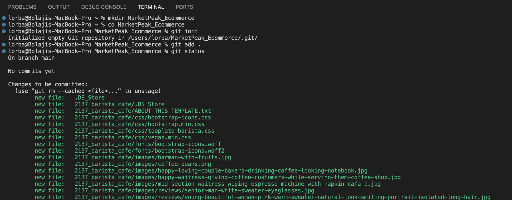

**1.i. Get Source code from template.com:**

1.ii. Obtain and Prepare the E-Commerce Website Template: As a devops engineer i don't need to write website codes, This is the work of a software developer and all i have to do is to dowload the existing E-commerce website template.

**1.iii. Downloading a Website Template:** Visit [Tooplate](https://www.tooplate.com) to download any suitable E-Commerce website template, you can also use other sites to do so.

The below images shows how it was downloaded to my local system.

The Zipped file was downloaded on my Local PC and i was able to unzip it on my Mac GUI (Graphical user interface), I then copy the extracted folder to the Directory (MarketPeak_Ecommerce) created on my version contron terminal.

**2: Stage and Commit the Template to Git:** This is the process of making git aware of the new items added and futher to commiting any changes been made and a description will be added to it anytime the commit is been performed.

See below image:

- `git add .`
- `git commit -m "Code files for Marketpeak"`

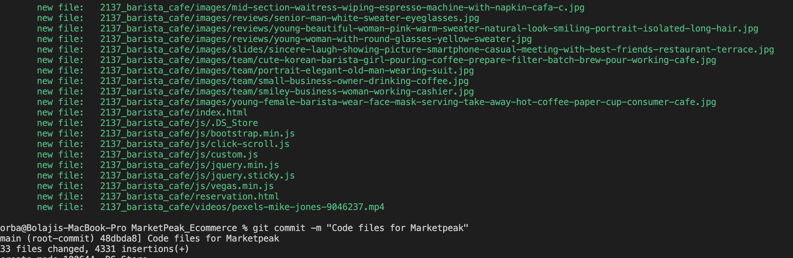

**3: Pushing the code to Github repository**

So far, I’ve been able to allow Git to track and monitor all the project work done locally on my system but that's is not enough, I need to create a github repository online naming it *MarketPeak_Ecommerce* and push from my local remote to the GitHub remote created online should incase my system brakes down or crashed, I can always go to the online repository created to recover my projects.

**3.i: Creating a Remote Repository on GitHub:**

The below images shows how i created my git repository named *MarketPeak_Ecommerce*

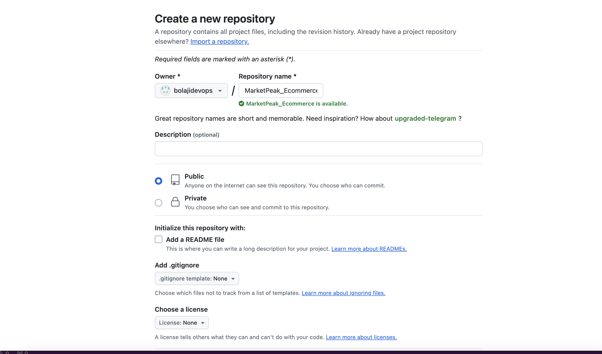

**3.ii. Linking my Local Repository to GitHub:** Navigated to the project directory (MarketPeak_Ecommerce)in my VS terminal and added the remote repository URL to my local repository configuration.

* `git remote add origin https://github.com/bolajidevops/MarketPeak_Ecommerce.git`

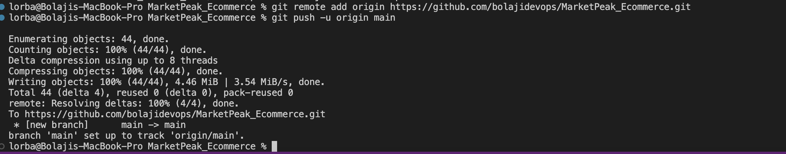

**3.iii. Pushing my code to GitHub repository:** The command below is used to carry out this task.

* `git push -u origin main`

See image above for better understanding of git cloning and pushing to github repository.

## Step 2: AWS Deployment

**Task 1: Setup an AWS EC2 instance for deployment**

- I Logged in to my AWS Management Console.
- I Launched an EC2 instance using an Amazon Linux AMI.
- Connecting to the instance using SSH.

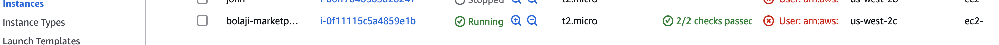

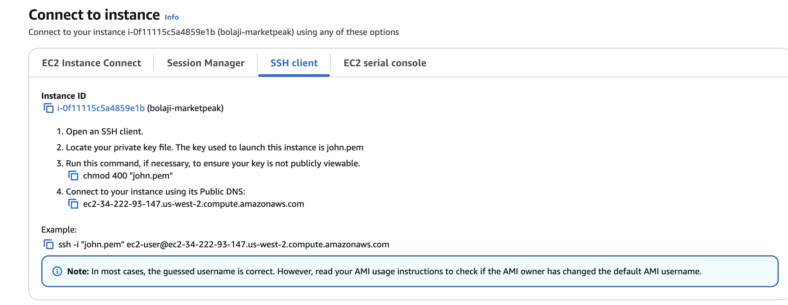

**Task 2: Cloning the repository on the AWS Linux Server**

I need to clone the GitHub repository to my AWS EC2 instance Before deploying my e-commerce platform. This has to do with authenticating with GitHub and there are two ways to do that which are SSH Cloning and HTTPS cloning For the sake of this project i will be using the SSH method.

**2.i Authenticating with GitHub using SSH:** On my Linux EC2 instance, i generated SSH keypair using ssh-keygen as shown below:

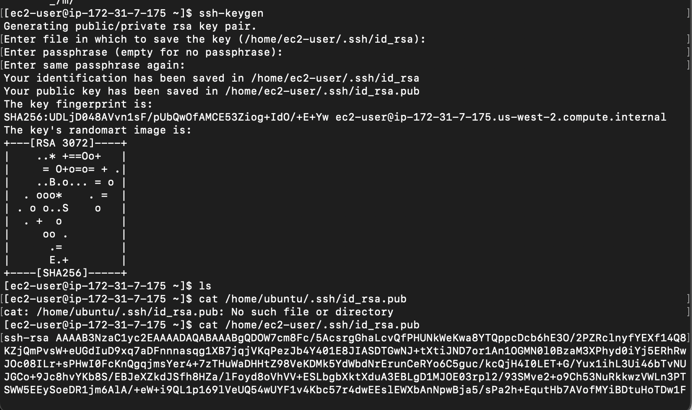

**2.ii Cat and copy the public key**

* `cat /home/ec2-user/.ssh/id_rsa.pub`

**2.iii. Adding SSH Public key to GitHub repository:**

Navigate to my image icon On my github account, Clicked on sttings, then click on SSH and GPGKeys.

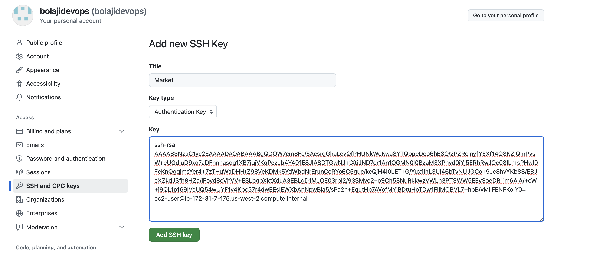

**Note:** This is a AWS Linux server by default git is not installed, so i have to run the command below to install git

- `sudo yum install git -y`

- `git clone git@github.com:bolajidevops/MarketPeak_Ecommerce.git`

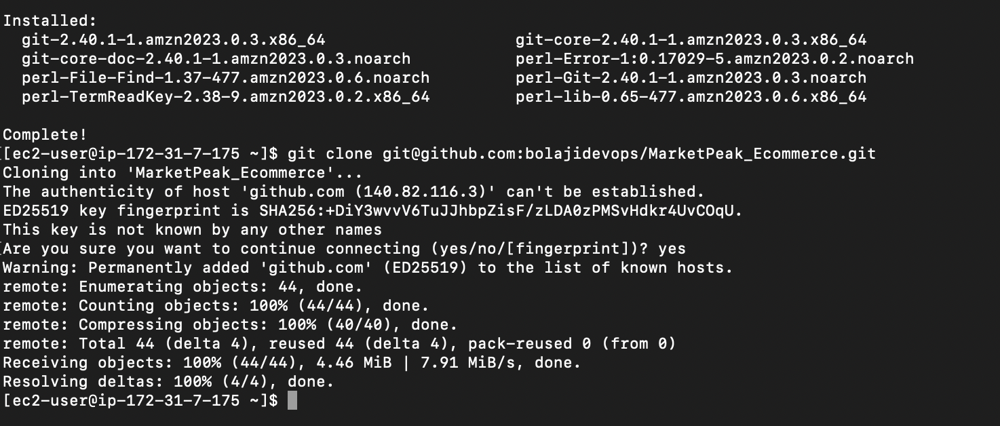

**Task 3: Installing Web Server on Linux EC2**

An Apache HTTP Server (httpd) is a widely used web server that serves HTML files and content over the internet. Installing it on Linux EC2 server allows me to host MarketPeak E-commerce site:

**3.i. Install Apache web server on the EC2 instance:** Note that httpd is the software name for Apache on redhats systems using yum package manager

The following commands will be use to intall Apache

- sudo yum update -y
- sudo yum install httpd -y
- sudo systemctl start httpd
- sudo systemctl enable httpd

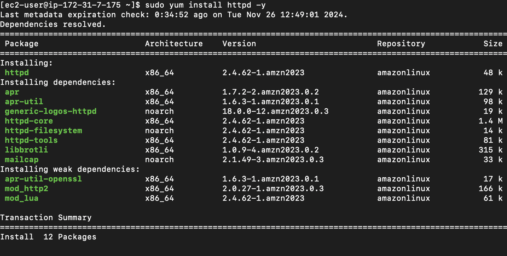

The above commands updates the linux server and then installs the httd (Apache), start the web server, and ensures it automztically start on server boot.

**3.ii. Configure httpd for Website:**

* **Prepare the Web Directory:** I Cleared the default httpd web directory and copy MarketPeak Ecommerce website files to it.

- sudo rm -rf /var/www/html/*  # Delete the default web directory
- sudo cp -r ~/MarketPeak_Ecommerce/2137_barista_cafe/* /var/www/html/ # copy the content of MarketPeak_Ecommerce cloned earlier

* Reload httpd: Apply the changes by reloading the httpd service.

* `sudo systemctl reload httpd`

**Task 4:** Accessing the Website from Browser With httpd configured and website files in place, MarketPeak Ecommerce platform is now live on the internet: By Opening a web browser and accessing the public IP (http://34.222.93.147/) of my EC2 instance to view the deployed website.

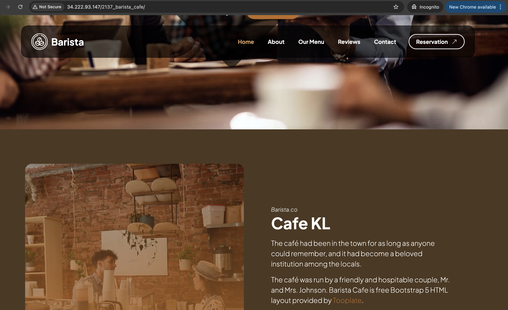

## Step3: Continuous Integration and Deployment Workflow

To ensure a smooth workflow for developing, testing, and deploying my e-commerce platform, The below structure will be implemented which covers making changes in a development environment, utilizing version control with Git, and deploying updates to your production server on AWS.

**Task 1:** Developing New Features and Fixes

* 1.i. Create a Development Branch: By creating a different branch called developement, This isolates new features and bug fixes from the original version of your website.

* `git branch development`
* `git checkout development`

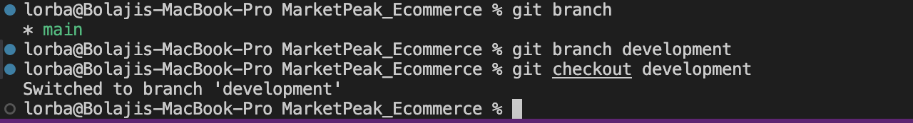

1.ii. Changes implemented: On the new branch (development), a new image was added to file (templates) to give a different background of the site.

**Task 2:** Version control with Git

The following commands were run to to stage, commit, and push to the branch (development):

* `git add .`
* `git commit -m "New Slide Added"`
* `git push origin development`

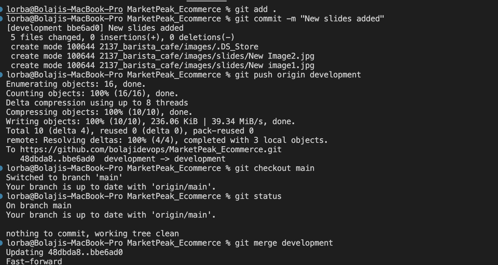

**Task 3:** Pull Requests and Merging to the Main branch

3.i. Creating a Pull Request: On the GitHub repo, i created a pull request to merge the branch (development) into the branch (main). This process is needed for code reviews and maintaining code qualities.

3.ii. Review and Merge the Pull request: Review the changes for any possible errors and if there is none, merge the pull request into the main branch, this will add the new features (image) into the pjoect codebase.

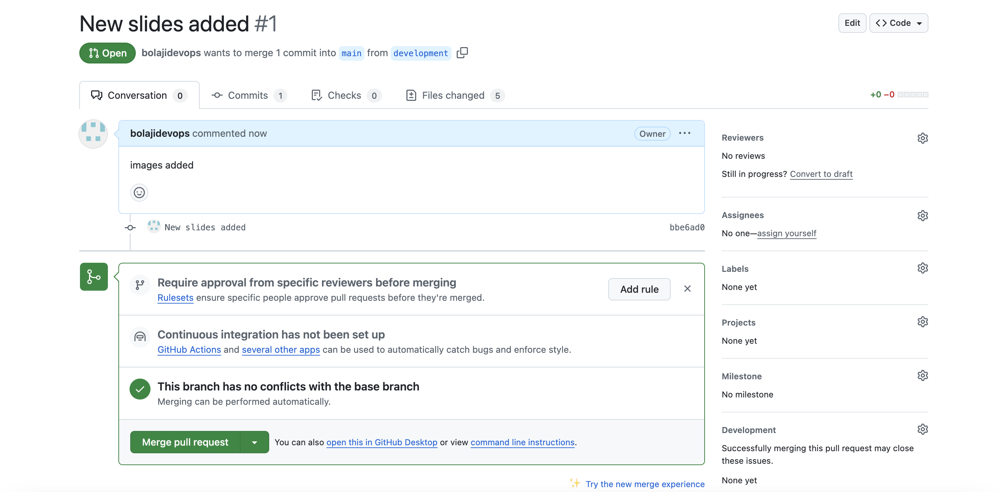

* `git checkout main`
* `git merge development`

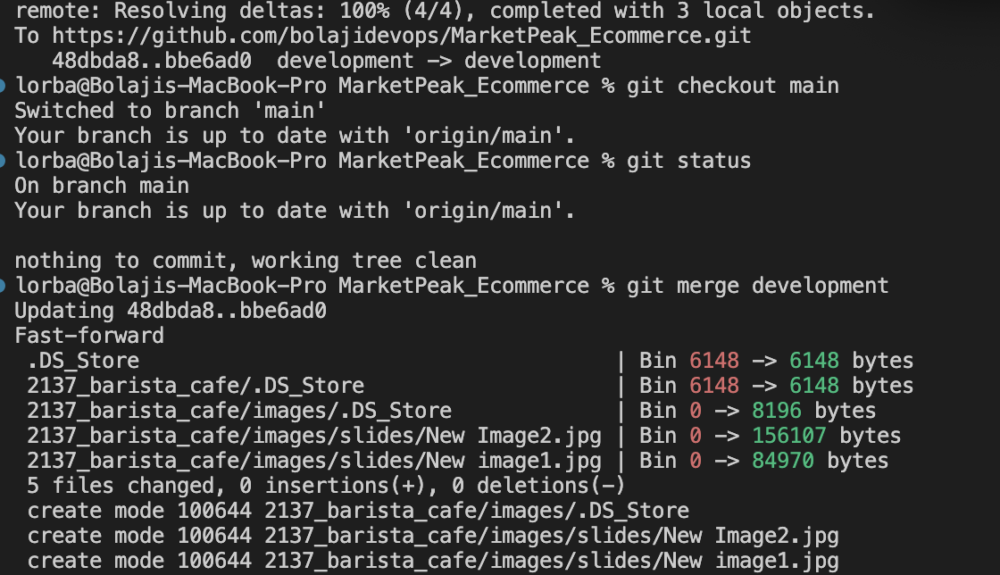

3.iii. Pushing the Merged Changes to GitHub: Ensuring that my local main branch has the new updates, is pushed to the remote repository on GitHub.

* `git pull`
* `git push origin main`

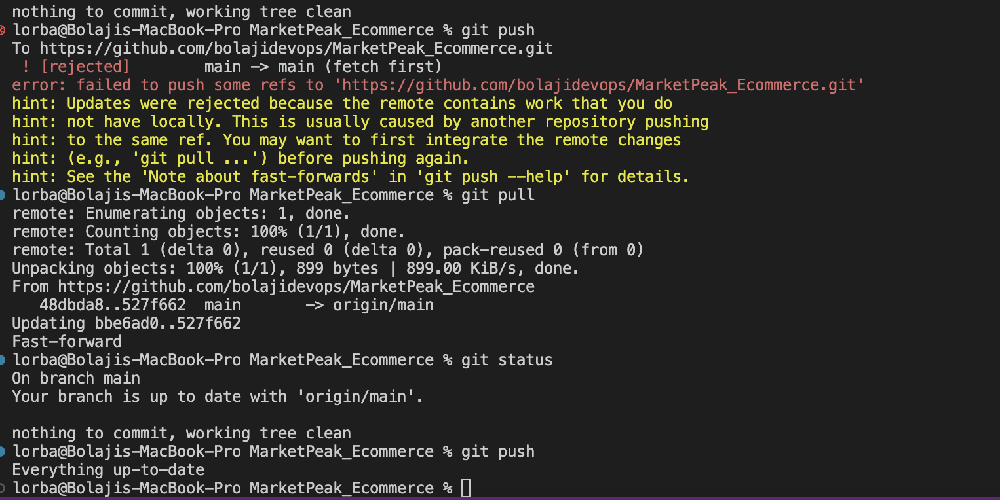

**Task 4:** Deploying Updates to the Production Server

4.i. Pulling the Latest Changes on the Server: By SSH into my AWS EC2 instance where the production website is hosted. I Navigate to the website's directory by CD'n into (MarketPeak_Ecommerce) and pull the latest changes from the main branch.

* `git pull origin main`

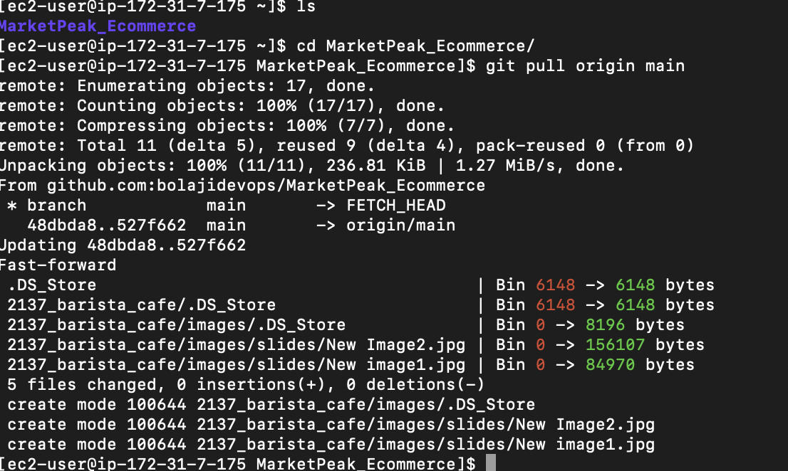

4.ii Restart the Web Server: The Web server may need to be restarted to apply the changes.

* `sudo rm -rf /var/www/html/*`
* `sudo cp -r ~/MarketPeak_Ecommerce/2137_barista_cafe/* /var/www/html/`

* `sudo systemctl reload httpd`

**Task 5: Testing the New Changes**

* 5.i Access the Website: Opening the web browser and navigating to the public IP address of my EC2 instance. Testing to confirm the new features (image) added to ensure they work in a real life world.

[Public Address](http://34.222.93.147/)

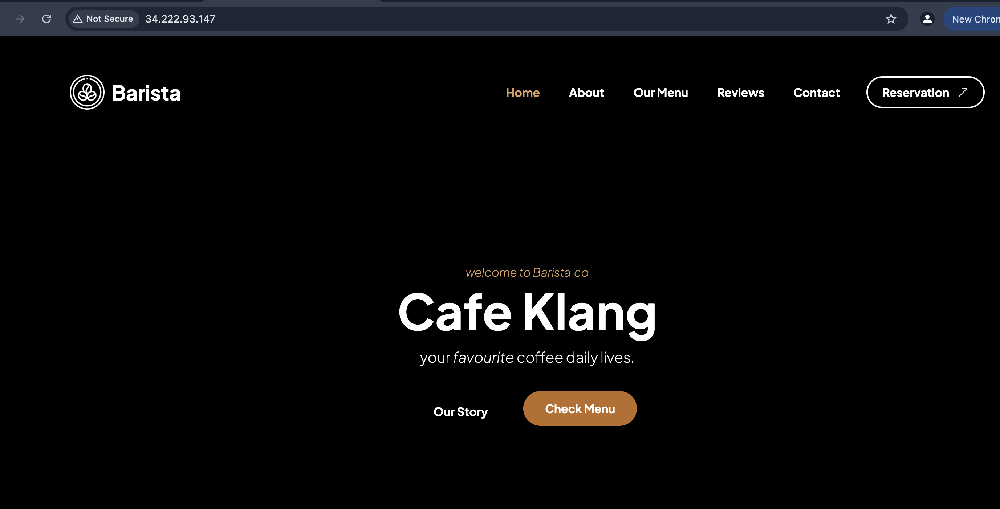

This workflow emphasizes best practices in software development and deployment as well as branch managements, code review through pull requests, and continuous integration/deployment strategies. By following these steps, you maintain a stable and up-to-date production environment for e-commerce platform.

